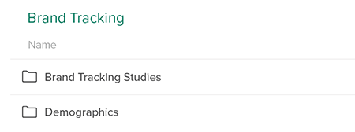
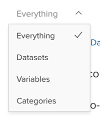

After signing in to Crunch, you will see your most recently open Project, which will contain one or more Datasets. Projects are listed down the left side of the interface. Click a project in the sidebar to open it.

Click a dataset in the list to open it.

In some projects, datasets may be organized into folders.

Click a folder to open it. While in a folder, breadcrumbs will be displayed above the list of datasets to allow you to navigate back to higher levels.

If you have access to datasets that are not in a project, either because you are an advanced user with the ability to import datasets, or because someone has shared one more datasets with you directly, these datasets will be available in **Personal Project**.

## Sorting the Dataset list

Click a column header to sort the dataset list by that column.

Right click the header area to open a dropdown from which you can select which columns will be shown:

The available columns are:

**Name** - The dataset name. Always enabled.

**Description** - The dataset description.

**Start Date/End Date** - The start and end dates for survey-based datasets.

**Created** - The date the dataset was created.

**Modified** - The date the dataset was last edited.

**Accessed** - The date that you last accessed the dataset. Searching by the column is a quick way to find a dataset you were working on recently.

**Owner** - The user or project to which the dataset belongs.. This column is only available in **Personal Project** (datasets in a project are owned by that project).

## Searching for a dataset

Search for a dataset by name, description, or using the names of any of the variables in the dataset using the search bar at the top of the screen. After searching, click a dataset name to open it, or click a variable name to open the dataset and display that variable card.

### Filtering search results

Search results can be refined using the two dropdowns at the top of the search panel.

#### Filtering by type

The left-hand dropdown is used to restrict what types of items are being searched.

Select **Datasets**, **Variables**, or **Categories** to limit your search to that type of object. E.g., if you selected **Variables** while searching for "Coffee", you would get a result for a dataset that contained a variable called **Coffee Preference**, but not for a dataset named **Coffee Brand Tracking Survey** (provided that dataset had no variables that included the word "Coffee").

For Categorical Array and Multiple Response variables, selecting **Categories** will also search subvariable names (see the [descriptions of Multiple Response and Array variables](crunch_variable-cards.html) for more information about subvariables).

#### Filtering by date

The right-hand dropdown lets you limit the time frame of the data being searched.

This filter uses the dataset **End Date** that can be seen in [Dataset Properties](crunch_dataset-properties.html). At this time, **End Date** is set on import or by a dataset editor.
