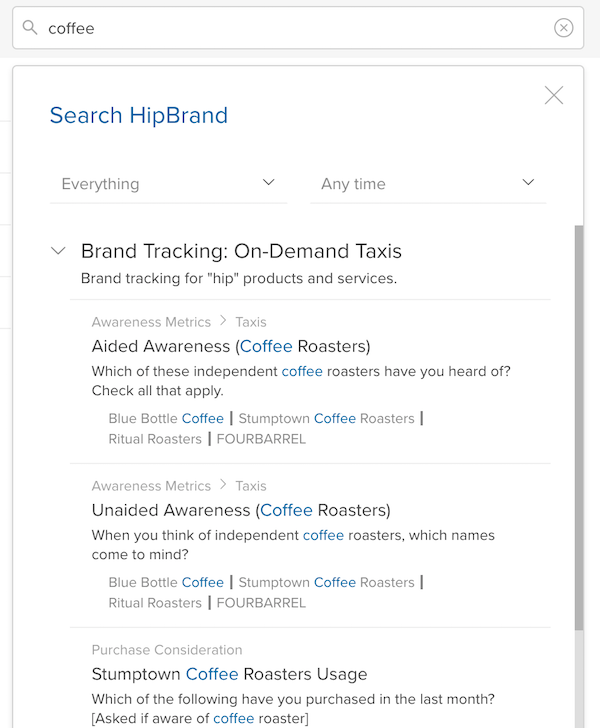

After signing in to Crunch.io, you will see your most recently open Project, which will contain one or more Datasets. Projects are listed down the left side of the interface. Click a project in the sidebar to open it.

Click a dataset in the list to open it.

In some projects, datasets may be organized into folders.

Click a folder to open it. While in a folder, breadcrumbs will be displayed above the list of datasets to allow you to navigate back to higher levels.

If you have access to datasets that are not in a project, either because you are an advanced user with the ability to import datasets, or because someone has shared one more datasets with you directly, these datasets will be available in **Personal Project**.

### Sorting the Dataset list

Click a column header to sort the dataset list by that column.

Right click the header area to open a dropdown from which you can select which columns will be shown:

The available columns are:

**Name** - The dataset name. Always enabled.

**Start Date/End Date** - The start and end dates for survey-based datasets.

**Created** - The date the dataset was created.

**Modified** - The date the dataset was last edited.

**Accessed** - The date that you last accessed the dataset. Searching by the column is a quick way to find a dataset you were working on recently.

**Owner** - The user or project to which the dataset belongs.. This column is only available in **Personal Project** (datasets in a project are owned by that project).

### Searching for a dataset

Search for a dataset by name, description, or using the names of any of the variables in the dataset using the search bar at the top of the screen. After searching, click a dataset name to open it, or click a variable name to open the dataset and display that variable card.

There are two ways to filter your results.  You can have crunch only search different parts of the datasets such as category
names, variable parameters (name, description, etc) or you can limit the search by a selected timeframe. Select the
appropriate filter from the dropdowns.

Here you can select if you would only like to find results based on Datasets, Variables, or Category names.
If you select "Datasets", it will search dataset name only.  "Variable" selection will only search variable names.
If you select "Category Names", categorical variable categories will be searched. Note that for Categorical Arrays and Multiple
 Response variables, the subvariable names are also searched if you select "Category Names".

The date filter limits the results to those datasets that have an end-date matching the range selected.  The end date
is set by a dataset editor, and usually indicates the end of a survey.  This can be modified by a dataset editor
in the [Dataset Properties](crunch_dataset-properties.html).

