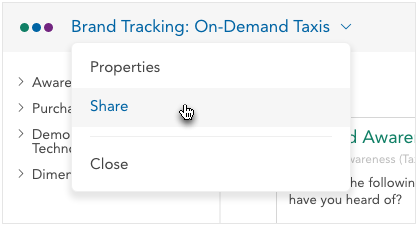
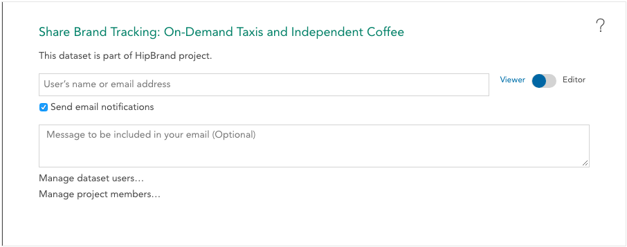

The crunch sharing interface allows you to share a dataset you have access to with one or more other users. If you are an advanced user managing a set of datasets shared with a set of client users, it is recommended you create a project as described in [Sharing Data With Clients](crunch_project-management.html) rather than using the sharing method described here.

Share a dataset by clicking the dataset name and selecting Share from the dropdown menu.

The share panel slides out.

Enter one or more comma-separated email addresses in the share dialog to share the dataset with other users. If they haven’t worked with data in Crunch before, they will be invited automatically.

If you have permission to edit the dataset, the **Manage dataset users** link will take you to [Permissions](crunch_sharing-properties.html), where you can change access and editorship of other users.

If the dataset belongs to a project that you have permission to edit, **Manage project members** will slide out the [project permissions](crunch_project-management.html) panel.
