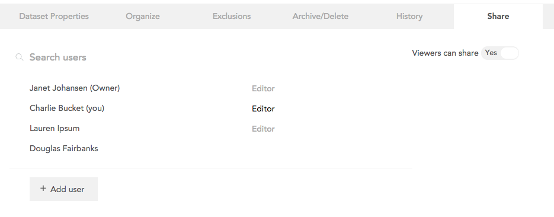

This interface can be accessed by clicking **Manage Sharing** in the sharing dialog (see [Sharing a Dataset](crunch_sharing-a-dataset.html)) or by clicking **Sharing** in dataset properties.

This interface shows a list of all users who can access this dataset. Hover over a user (other than the owner) to reveal an x that can be clicked to remove them from the list.

Share with additional users by clicking New User at the bottom of the list. When sharing with a user from this page, a Default Filter dropdown appears allowing one of the existing filters on the dataset to be selected (i.e. if a viewer is only interested in United States respondents, the dataset can be pre-filtered for them rather than having to instruct them to apply the filter).

The **Viewers Can Share** option determines whether viewers of the dataset can share it to other users. The owner and the current editor can always share (and can modify this property).

### Transferring editing rights

The owner or current editor of a dataset can transfer editorship rights from this interface. All users who can become editors will have **Editor** next to their names (the current editor will be highlighted). Select **Editor** next to another user to transfer editing rights.

