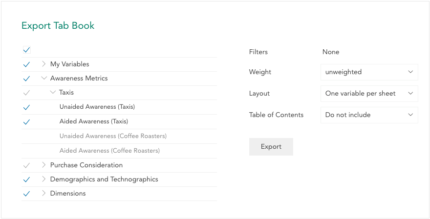

A tab book consists of a multitable header crossed by some or all of the variables in the dataset.

To export a tab book to Excel:

Create and save a multitable header as described in [Multitables](crunch_multitables.html).

In multitable view, click **Export** and select **Export tab book** from the dropdown menu.

This opens the **Export Tab Book** panel:

On the left side of the panel, you can select which variables will be included as rows in a the tab book. By default all variables will be selected.

On the right side, you can set the following options:

**Filters** – Select any filters that should be applied to the tab book. By default any filters you had selected will still be present, and you can add and remove filters as described in [Filtering Data](crunch_filtering-data.html). At this time you cannot create a new filter while creating a tab book; you'll need to cancel the export and create the filter you need.

**Layout** – By default each row variable will be shown on a separate Excel sheet in the exported workbook. Select **All variables on one sheet** to export the entire tab book on a single sheet; this can make it easier to navigate through the tab book in Excel.

**Table of Contents** – Set this to **Include TOC** to have the exported Excel workbook include a table of contents sheet in the front. This table of contents will contain a link to each exported row variable, which will link to the appropriate sheet or position in the sheet (if **All variables on one sheet** was selected above).

**Weight** – Use this dropdown to specify whether the tab book will use weighted data. By default this option will be set to your current weighting.

Click **Export** to begin exporting. For large datasets exporting can take some time. Once complete a **Download** button will appear.

Click **Download** to download the tab book as an Excel file.
