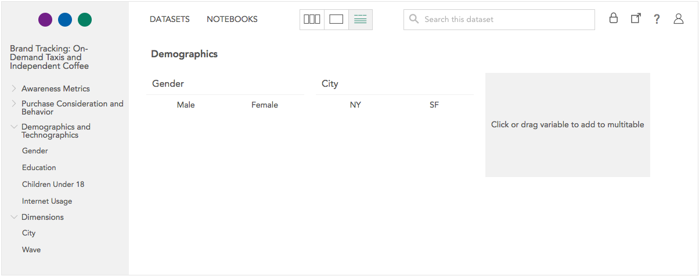

A tab book consists of some or all of the variables in the dataset crossed with a multitable header.

To export a tab book to Excel:

Create and save a multitable header as described in [Multitables](crunch_multitables.html).

In multitable view, click **Export** and select **Export tab book** from the dropdown menu.

This opens the **Export Tab Book** panel:

On the left side of the panel, you can select which variables will be included as rows in a the tab book. By default all variables will be selected.

On the right, you can set the following options:

**Filters** – Select any filters that should be applied to the tab book. When you enter the export panel, any filters you had selected in the multitable analysis view will be enabled, and you can add and remove filters as described in [Filtering Data](crunch_filtering-data.html). If the filter you want to use does not yet exist, click "cancel" to close the export panel, create the new filter object, and then return to the export panel.

**Weight** – Select a weight variable to compute a tab book with weighted data, or select "unweighted". If you had a weight variable applied in the multitable analysis view, it will already be selected when you enter the export panel.

**Layout** – By default, each variable in the tab book is written to its own worksheet in the exported Excel file. Select **All variables on one sheet** to write the entire tab book on a single worksheet; this can make it easier to navigate through the tab book in Excel.

**Table of Contents** – Set this option to **Include** to have the Excel workbook include a table of contents worksheet in the front. For each variable in the tab book, this table of contents will link to the appropriate worksheet (or position in the single sheet if **All variables on one sheet** was selected).

Click **Export** to request the tab book. For large datasets, exporting can take some time. Once the Excel workbook is ready, a **Download** button will appear.

Click **Download** to download the Excel file.
