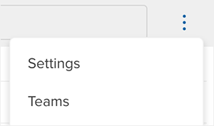
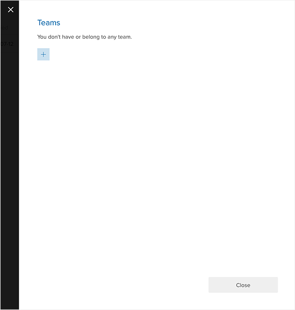
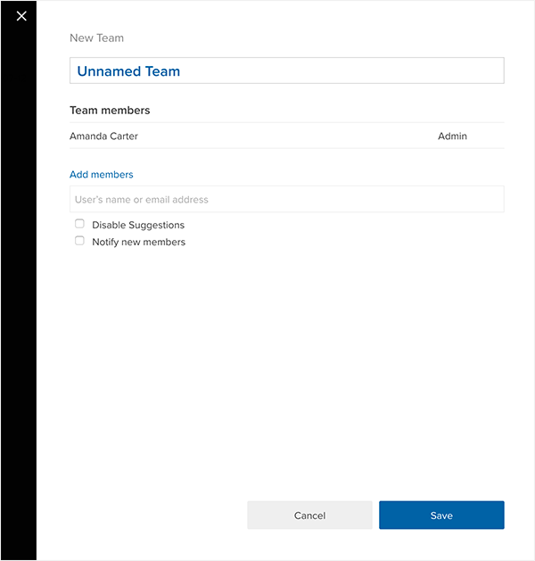
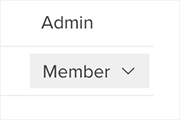

Crunch allows you to share a dataset or a project you have access to with a group of users inside a team.

### Creating a Team

To create a team, click the vertical ellipsis menu on the top right corner and select **Teams**.

This opens a Teams panel.

Click the + to add a **New Team**. This will open another panel where you can edit the name of the team and add members. Enter the name or email addresses of the users you want to add to the team. You can choose to disable suggestions or to notify new members once you’re done. If you enter any email addresses that are not associated with a Crunch user, those users will be invited to Crunch. Once you are finished, click **Save**.

Click a user’s permission to change it. Team members can be either:

**Admin** – Full permission to manage the team.

**Member** – Permission to view projects and all datasets shared with the team.

### Sharing a Project or Dataset with a Team

If you have created a team or have been added to one you're able to share a project or a dataset with this team or multiple teams.

[Sharing a Dataset](crunch_sharing-a-dataset.html) - gives you information on how to share a dataset with members and teams.

[Sharing Data to Multiple Users with Projects](crunch_project-management.html) - gives you information on how to share a dataset with members and teams.
