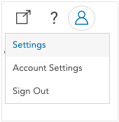
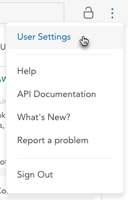

In user settings, you can change your display name as well as global settings that apply to your view of all datasets. 

To open user settings, click the person icon in the upper right corner of the application and select **Settings**.

This opens the **User Settings** panel.

This panel contains the following settings.

#### Name

The name that will be displayed for you within Crunch.io.

#### Email

The email address you use to sign in to Crunch.io. This setting is read only. If you need to change to your email address, contact your administrator.

#### Variable card display options

Use these settings to determine whether variable aliases or notes will be displayed on the variable card. These values can also be seen in [Variable Properties](crunch_variable-properties.html).
