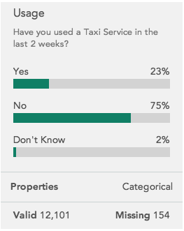
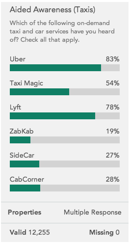
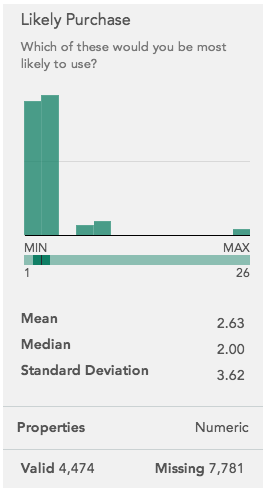
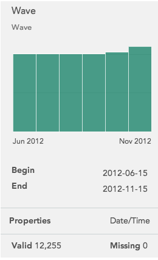
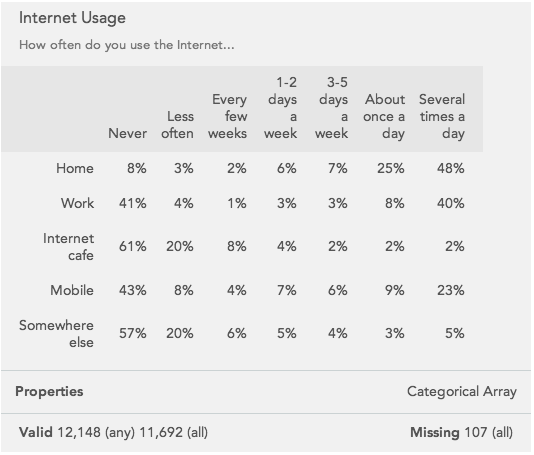
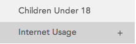
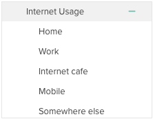

The following variable card types are used to display data in browse mode:

### Categorical

A categorical variable represents a question for which the respondent could
choose exactly one answer. Click the Valid/Missing area at the bottom of the
card to show missing reasons.

### Multiple Response

A multiple response variable represents a question for which the respondent
could choose any number of responses, i.e. “choose all that apply.” As with
categorical variables you can click the Valid/Missing area to show missing
reasons.

### Numeric

A numeric variable represents a question to which the respondent gave a
numeric answer. The variable card displays a histogram of the responses as
well as summary statistics.

### Date/Time

A date/time variable represents a timestamp, for example the date of a survey.
The variable card displays a histogram of the dates in the variable.

### Categorical Array

A categorical array represents a series of questions with the same response
options. The responses are shown in the columns while the individual questions
are shown in the rows.

Valid/missing shows how many valid responses there are for any question in the
array as well as for all questions in the array. For example, if a respondent
did not have a mobile device in the array above, they would be counted under
Valid (any), but not Valid (all).

Click Valid or Missing  to see the number of missing values for each row.

#### Array Variables in the Sidebar

Hover over a categorical array variable in the sidebar to display a plus
symbol next to the name.

Click the plus to show the variables that make up the array.

