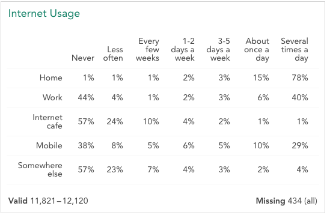

In card view, each variable appears on a **Variable card**. The variable card displays a top-line summary of the data contained in that variable.

Hover your mouse cursor over a variable to reveal the **Properties** link below the card -- click this link to reveal [Variable Properties](crunch_variable-properties.html) for that variable. Note that if you cannot edit the dataset, these properties will be read-only.

The following variable types are currently supported by Crunch.

# Categorical

A categorical variable represents a question for which the respondent could choose exactly one answer. Click **Valid/Missing** at the bottom of the card to show missing values and reasons.

# Multiple Response

A multiple response variable represents a question for which the respondent could choose any number of responses, i.e. "choose all that apply." As with categorical variables you can click the Valid/Missing area to show missing values and reasons.

# Numeric

A numeric variable represents a question to which the respondent gave a numeric answer. The variable card displays a histogram of the responses as well as summary statistics.

# Date/Time

A date/time variable represents a timestamp, for example the date of a survey. The variable card displays a histogram of the dates in the variable.

# Categorical Array

A categorical array represents a series of questions with the same response options. The responses are shown in the columns while the individual questions are shown in the rows.

Valid/missing shows how many valid responses exist for any item (row) in the array, which is usually a range. In the example above, if a respondent was not asked about mobile internet usage because they did not have a mobile device, they would not be included in the "Mobile" row. "Missing (all)" indicates the number for which no valid category is selected for any of the items in the array.

Click Valid or Missing to see the number of missing values for each row.

# Array and Multiple Response Variables in the Sidebar

Hover over an array or multiple response variable variable in the sidebar to display a plus symbol next to the name.

Click the plus to show the variables that make up the array.

