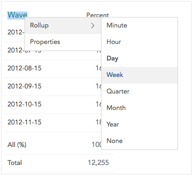

When analyzing in [Expanded View](crunch_analyzing-data.html) you can right click a variable name to see options for changing the view of that variable (as well as open [Variable Properties](crunch_variable-properties.html). At this time, you can only do this when viewing data as a table. Note that any changes made here will not affect the underlying variable, only the currently displayed analysis. If an analysis is saved, these options will be saved with it.

The following variable types can have their display changed.

### Categorical

**Show Means** – Use the mean of the selected variable as cell values. Only available if the categorical variable has numeric values (see [Variable Properties](crunch_variable-properties.html)).

### Numeric

Right click a numeric variable to toggle between:

**Show Discrete Values** – Each discrete value will be a row/column in the table.

**Show Ranges** – The numeric variable will be binned into ranges. At this time, these ranges are determined programatically; in future releases we expect to allow you to customize the range sizes.

**Show Means** – Use the mean of the selected variable as cell values. 

### Date Time

Hover over **Rollup** to show a submenu from which you can choose the rollup for the date/time data. Note that if you are an editor you can set the default rollup for a date/time variable in [Variable Properties](crunch_variable-properties.html)]