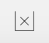
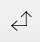

### Using the Display Controller

The Display Controller at the bottom of the analyze interface can be used to determine how the data in a graph or table is displayed.

Which controls are available depends on the analysis being viewed.

Table/Graph – Use this control to toggle between showing a table and a graph. The graph type will vary by the types of the variables in the analysis.  

 

Count/Percentage, Percent Direction, and Significance testing – Use this control to toggle between counts and percentages. If viewing percentages in a bivariate table or graph, click the arrow control to toggle between percentages summing by column (down), by row (right), or across the whole table. When viewing a table, click the * to enable significance testing – this will add shading to the graph indicating if a value is significantly above or below the mean value for that row or column (depending on how the percentages are being summed).  

Decimal Places – If viewing an analysis that uses decimal points either for percentages or for numeric means, use this control to determine how many digits are shown after the decimal point.  

Show Empty – If unselected any rows or columns in a table or graph that are entirely empty will be hidden. If selected, empty rows and columns will be displayed. Note that adding filters may cause a row or column to become empty.  

Swap – Click this control to swap the row variable and the column/group/slice variable.  

###Changing how a Variable is used in a Table

When analyzing a table in [Expanded View](crunch_analyzing-data.html) you can right click a variable name to see options for changing the view of that variable (as well as open [Variable Properties](crunch_variable-properties.html). At this time, you can only do this when viewing data as a table. Note that any changes made here will not affect the underlying variable, only the currently displayed analysis. If an analysis is saved, these options will be saved with it.

At this time, these changes can only be made when viewing a table. If you want to change how variables are displayed in a graph, use the play controller to display the table, make changes, and then switch back to a graph.
The following variable types can have their display changed.

### Categorical

**Show Means** – Use the mean of the selected variable as cell values. Only available if the categorical variable has numeric values (see [Variable Properties](crunch_variable-properties.html)).

### Numeric

Right click a numeric variable to toggle between:

**Show Discrete Values** – Each discrete value will be a row/column in the table.

**Show Ranges** – The numeric variable will be binned into ranges. At this time, these ranges are determined programatically; in future releases we expect to allow you to customize the range sizes.

**Show Means** – Use the mean of the selected variable as cell values.

### Date Time

Hover over **Rollup** to show a submenu from which you can choose the rollup for the date/time data. Note that if you are an editor you can set the default rollup for a date/time variable in [Variable Properties](crunch_variable-properties.html)]
