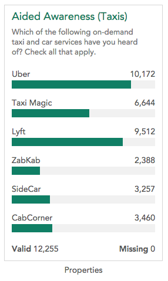
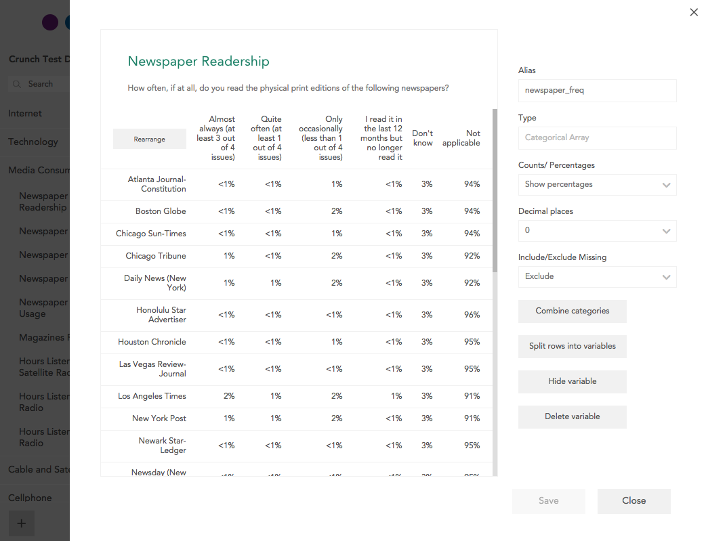
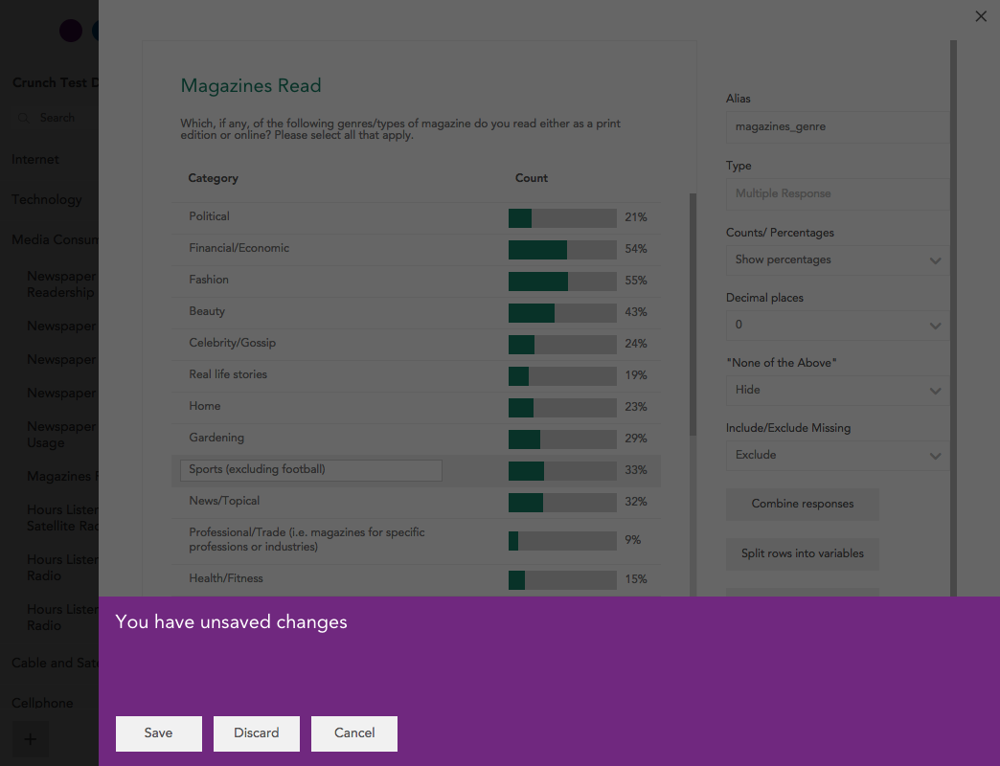

When editing a dataset, you can access properties of individual variables by clicking **Edit** underneath the variable card.

You can edit the name and description of all variables, as well as hide or delete them. (To change more than one variable at a time, names and descriptions can also be edited in the [variable organizer](crunch_variable-organizer.html))

Additional properties depend on the variable type:

### Categorical Variable Properties

**Numeric Values** – Show or hide the numeric value associated with each category. These values can be used to treat the variable as numeric (and compute its mean) in an analysis.

**Counts/Percentages** – Show counts or percentages on the variable card.

**Decimal Places** – If showing percentages, how many decimal places to display on the variable card.

**Include/Exclude Missing** – If set to **Include**, missing categories will be shown on the variable card and missing rows will be used when calculating percentages.

### Numeric Variable Properties

**Use as Weight** – Set to yes to use this numeric variable as a weight for the dataset. Weight variables can also be created using existing categorical variables using the Weight Builder.

**Add Missing Value/Range** – Designate a value or range of values on this numeric value that should be marked as missing.

### Text Variable Properties

**Counts/Percentages** – Show counts or percentages on the variable card.

**Decimal Places** – If showing percentages, how many decimal places to display on the variable card.

**Add missing** – Designate a text string to be treated as missing.

### Multiple Response Variable Properties

**Counts/Percentages** – Show counts or percentages on the variable card.

**Decimal Places** – If showing percentages, how many decimal places to display on the variable card.

**“None of the Above”** – If set to **Yes**, the variable will include a None of the Above category used for rows in which none of the constituent variables is true.  

**Include/Exclude Missing** – If set to **Include**, missing categories will be shown on the variable card and missing rows will be used when calculating percentages.

**Split** – Turn each row of the variable into a separate categorical variable.

### Array Variable Properties

**Counts/Percentages** – Show counts or percentages on the variable card.

**Decimal Places** – If showing percentages, how many decimal places to display on the variable card.

**Include/Exclude Missing** – If set to Include, missing categories will be shown on the variable card and missing rows will be used when calculating percentages.

**Rearrange** – Change the names, values, missingness, and order of items and categories.

**Split** – Turn each “row” item of the array into a separate categorical variable

When finished, you can save your changes, and if you cancel, you’ll be asked to confirm that you want to discard changes.

