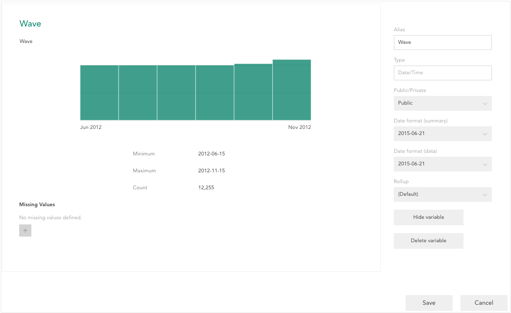

In card view, you access properties of an individual variables by clicking **Properties** below the variable card (this link appears when you hover on the card). In expanded view, right click a variable name and select **Properties** (this currently only works when viewing an analysis as a table). Dataset viewers can only view these properties. Dataset editors can edit them if they are the active editor - see [Datasets with Multiple Editors](crunch_multiple-editors.html).

Variable properties open in a panel that slides in from the right side of the screen. Any changes you make to variable properties will not be saved until you click **Save**.

### Common properties

All variables contain the following properties and actions:

**Name** – Click the variable name in the top-left to edit it.

**Description** - Click the variable description just below the name to edit it.

**Alias** – The alias is a unique identifier of the variable within the dataset. It allows, for example, the variable to be identified during an append even when the name has changed.

**Type** - The variable type. Currently read-only for all users.

**Public/Private** - A private variable is only visible to the current user. Making an existing variable private will prevent other users from seeing it.

**Hide Variable** – Hiding a variable removes it from the sidebar, search results, and card view. Editors can see and unhide variables in the Variable Organizer. Hidden variables can still be used as weights, or as a source for a derived variable.

**Delete Variable** – Deleting a variable removes it from the dataset entirely. This may result in the removal of filter, analyses, weights, and derived variables that depend upon it.

### Categorical Variable Properties

#### Category properties

When viewing a categorical variable, the left side of the properties pane shows the variable categories. These categories can be reordered by dragging them up and down the list. In addition, you can make the following changes to each category:

**Name** – Click a category name to edit it.

**Value** – Each category has an optional numeric value. This value is used when taking the mean of a categorical variable.

**Missing** – A category can be set to missing by hovering over it and checking the box in the Missing column.

#### Variable properties and actions

These properties are shown on the right of the variable properties page and affect the entire variable:

**Numeric Values** – Determines whether the numeric values on the variable will be shown on the variable card. If you show variables without specifying them, the card will show an empty box for the variable value.

**Include/Exclude Missing** – If set to **Include**, missing categories will be shown on the variable card and missing rows will be used when calculating percentages.

**Combine Categories** – Combine the response categories of variable to create a variable with fewer categories, e.g. combine iPhone 3, iPhone 4, iPhone 5, and iPhone 6 into "iPhone." See [Combining Categories](crunch_creating-a-combined-variable.html) for more information.

**Edit Combination** – If this variable was derived by [Combining Categories](crunch_creating-a-combined-variable.html) of another variable, this allows you to change how the categories are combined, e.g. rather than grouping all iPhones together, you could change to "iPhone 4 and earlier" and "iPhone 5 and later."

### Numeric Variable Properties

**Add Missing Values/Ranges** – A list of missing values and ranges appears on the left side of variable properties. Click the + to slide a panel out from the right where you can define a missing value or range along with a reason. Hover over an existing missing value to reveal an 'x' that you can click to remove an existing missing value or range from the list (the removed value will become grayed out – it will not be removed until you save changes).

**Use as Weight** – Set to yes to use this numeric variable as a weight for the dataset. Once set to yes a weight using this name will become available in the Weight dropdown. Weight variables can also be created by setting targets for specified categorical variables using the Weight Builder as described in [Creating Variables](crunch_creating-variables-for-dataset-editors.html).

### Date/Time Variable Properties

**Date format (summary)** – Sets the format used to display dates on the date/time variable card as well as in tables and graphs.

**Date format (data)** – Sets the date format used when displaying raw data. Raw date/time data is not currently displayed in Crunch.

**Rollup** – The smallest degree of precision that will be used for this date/time data. E.g. if **Month** is chosen a table using this variable will group this variable into months, even if the data is more precise. Yearly rollups start January 1st. Quarterly rollups start January 1st, April 1st, July 1st, and October 1st. Monthly rollups start on the first of each month. Weekly rollups start on the Monday of each week. The **Default** value selects a rollup based on the range of data. You can change the displayed rollup when viewing a table by right-clicking the variable name as described in [Customizing a Table or Graph](crunch_variable-display-in-expanded-view.html).

### Text Variable Properties

**Add Missing Values** – A list of missing values appears on the left side of variable properties. Click the + to slide a panel out from the right where you can define a missing value along with a reason. Hover over an existing missing value to reveal an 'x' that you can click to remove an existing missing value from the list (the removed value will become grayed out – it will not be removed until you save changes).

### Multiple Response Variable Properties

#### Category properties

When viewing a categorical variable, the left side of the properties pane shows the categories. These categories can be reordered by dragging them up and down the list. You can also change the name of a category by clicking it.

#### Variable properties

These properties are shown on the right of the variable properties page and affect the entire variable:

**“None of the Above”** – If set to **Show**, the variable will include a None of the Above category used for rows in which none of the constituent variables is true. If set the **Hide** this category will be hidden.

**Include/Exclude Missing** – If set to **Include**, missing categories will be shown on the variable card and missing rows will be used when calculating percentages.

**Split rows into variables** – Turn each row of the variable into a separate categorical variable.

### Array Variable Properties

#### Reordering and renaming rows and columns

Click **Edit** to edit the names of the row and column labels and to change the order of rows and columns. The left side of the variable properties will change to a 2-column display – the first column represents the array rows, the second column represents the array columns (now reading vertically rather than horizontally). Perform any of the following actions:

**Edit row and column labels** – Click a row or column label to edit it.

**Edit row and column order** – Click and drag to reorder either list.

**Set column numeric values** – Each column has an optional numeric value. These values will be used if a subvariable of an array is used as a mean.

**Missing** – Each column can be set missing by checking the box in the Missing column that appears when you hover.

Click **Back** once you have made any changes here to go back to the main array variable properties.

#### Variable properties

These properties are shown on the right of the variable properties page and affect the entire variable:

**Include/Exclude Missing** – If set to Include, missing columns will be shown on the variable card and missing rows will be used when calculating percentages.

**Split rows into variables** – Turn each row of the array into a separate categorical variable.

### Sentiment Analysis

If you have a text variable, you can unlock the potential of this resource by determining whether entries are Positive, Negative, or Neutral.  
On text variables, you will find the "Classify" button. 

Clicking this will create a new categorical variable containing the sentiment analysis for the text variable.  Note that you have to be
an editor in order for this option to become available when viewing variable properties.

The initial version of this feature uses a modern (slightly American inflected) English lexicon, tailored especially for terms that occur in social media:

> [Hutto, CJ and Gilbert, E. (2014) "VADER: A Parsimonious Rule-based Model for Sentiment Analysis of Social Media Text". Eighth International Conference on Weblogs and Social Media (ICWSM-14). Ann Arbor, MI, June 2014](https://github.com/cjhutto/vaderSentiment).

We have plenty of plans for future work in this area, including other languages, a way to provide your own tailored lexicons, coding of data into a broader range of categories, specifying your own coding for text data, and more.

