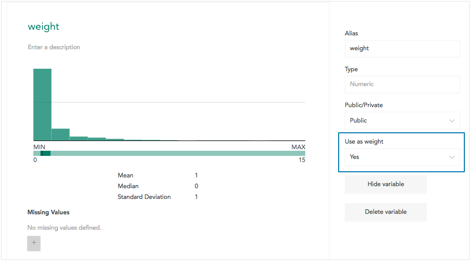

Weighting a dataset allows you to adjust the data to a specific required ratio of one or more variables - usually demographic variables. For example, if 1000 people were surveyed - 550 men and 450 women, but the study in question was for an area that had a 50/50 split of men and women, you could weight the responses of the women more heavily to adjust for the uneven split in your sample size.

A weight variable is a numeric variable where each row contains a multiplier that indicates how that row should be given more or less importance. When a weight is created in Crunch, this numeric weight variable is created by specifying the target values for one or more categorical values (in the example above, 55% Male and 45% Female). A weight variable can be constructed from multiple categorical variables (for example to adjust the data for target gender, age, and income distributions).

###Selecting a Weight

**Weighted** or **Unweighted** will appear in the upper right corner of the interface when viewing a dataset, indicating whether the dataset is currently weighted. Click the weight to open a dropdown menu you can use to select a weight or turn off weighting.

###Making an Existing Variable a Weight

Only a dataset editor can make an existing variable a weight. A dataset may be imported into Crunch with a weight variable already created by another tool. To specify that an existing numeric variable can be used as a weight, open the [Variable Properties](crunch_variable-properties.html) for that variable and set the **Use as Weight** dropdown to **Yes**.

###Creating a Weight

Only a dataset editor can create a weight. When a dataset editor opens the weight dropdown described above, **Create Weight...** appears at the bottom of the list. Click this to open the weight builder. The weight builder can also be access through the [New Variable](crunch_creating-variables.html) screen.

Select one or more existing categorical variables that will be used to create the weight.

For each selected variable, its categories and the distribution of responses in those categories will be shown in the **Sample** column. Enter the normalized values you would like to use in the **Target** column. These values must sum to 100.

Name the weight by clicking on the name. The default name is **Weight**, since it is common for a dataset to contain only a single weight.

### Setting a Default Weight

An editor can set a default weight for a dataset. This is the weight that will be set when a user opens a dataset for the first time, e.g. after it is shared with them. To set the default weight, click the dataset name to open dataset properties, click the [Permissions](crunch_permissions-and-defaults.html) tab, and then choose a default weight from the dropdown.
