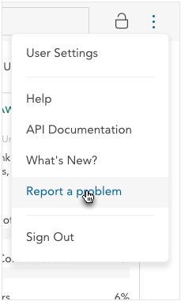

You can browse support topics using the menu on the left. The <strong>Dataset Editors</strong> category describes features that are only available to dataset editors. Contact <a href="mailto:support@crunch.io">support@crunch.io</a> for more information about how to upload your own datasets.

<h3>Reporting a Bug</h3>

If you believe you have found a bug, you can report it from within the application - click your user name in the upper right and select <strong>Report a Problem</strong>. You’ll be able to send us a message along with a screenshot which should help us to diagnose the problem. You can also email us at <a href="mailto:support@crunch.io">support@crunch.io</a>. 

<h3>Requesting a Feature</h3>

If there are any features you’d like to see added to Crunch.io, we’d love to hear about them. Please email us at <a href="mailto:support@crunch.io">support@crunch.io</a>.

